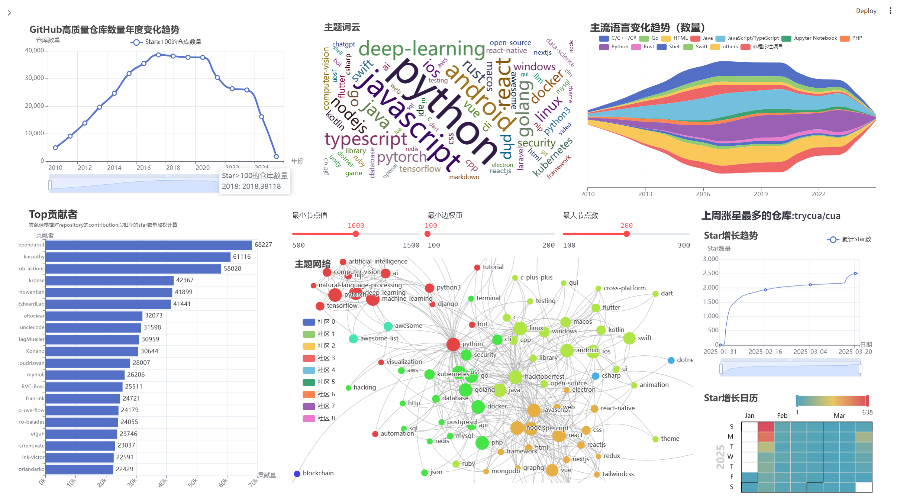
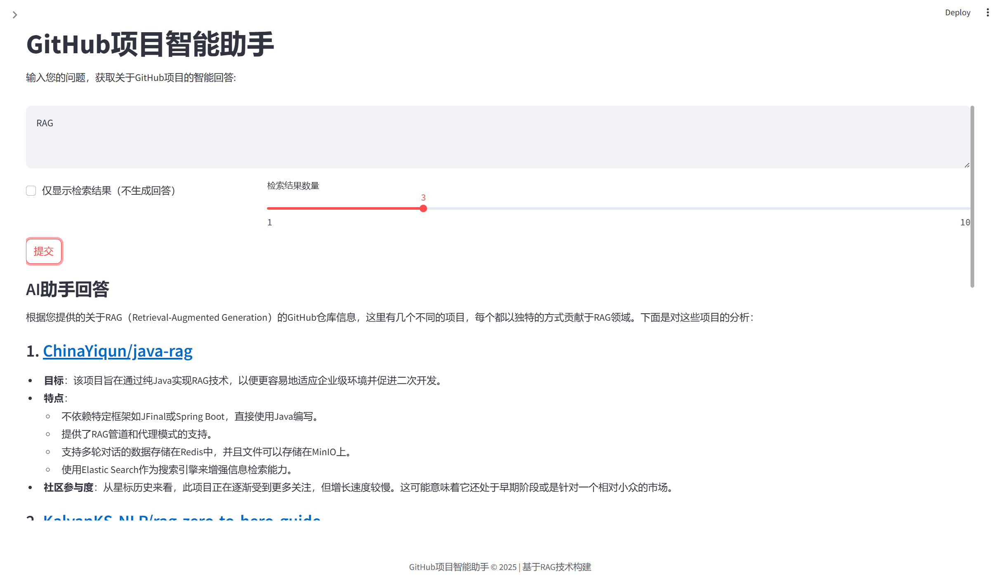

# GitHub Top Stars

A tool for fetching, analyzing, and visualizing GitHub repositories.

**This is directly translated from the file [中文README](./README.md).**

## Core Features

- Automatically fetch repositories with stars above a certain threshold (default is 100):
    - Fetch data in weekly batches to avoid API rate limits.
    - Store basic repository information in MySQL.
- Retrieve detailed repository information, including contributors, star history, and README content:
    - Use the vector database Qdrant to store detailed non-relational information.
- Perform data analysis based on locally saved data and provide a web interface to display the analysis results.
    - 

- Build RAG using Qdrant and the Qwen API.
    - 

## Installation and Usage

### Environment Requirements

- Python 3.9 or higher
- MySQL
- Qdrant

### Install Dependencies

```bash
pip install -r requirements.txt
```

### Usage Instructions

1. Fetch top-starred repositories from GitHub:
```python
from tools.get_data import get_top_starred_repos, DEFAULT_SETTINGS

# Set start and end dates
start_date = "2023-01-01"
end_date = "2023-12-31"

result = get_top_starred_repos(None, start_date, end_date, DEFAULT_SETTINGS)
```

2. Retrieve detailed information for a specific repository:
```python
from tools.get_data import get_repo_details, DEFAULT_SETTINGS

# Get repository details by repository name
repo_details, _ = get_repo_details("owner/repo", "https://github.com/owner/repo", DEFAULT_SETTINGS)
```

3. Run the Web application (ensure your database contains some data):
```python
streamlit run ./app/home.py

# Get repository details
repo_details, _ = get_repo_details("owner/repo", "https://github.com/owner/repo", DEFAULT_SETTINGS)
```

## Additional Notes

- This project uses the GitHub API, so you need to register and obtain an API key.
- Due to insufficient GPU memory on the author's machine, this project uses the Qwen text-embedding model for better results, which also requires registration and obtaining an API key:
    - Alternatively, you can download embedding models from Hugging Face.
- Data retrieval takes a long time, especially for the `get_repo_details` function. With the current settings, it takes about an hour to retrieve detailed data for approximately 250 repositories. If you need daily updates of local data, consider using multithreading for data retrieval.
    - Since star history can only be retrieved one day at a time and then aggregated, if you don’t need historical star data, you can comment out the call to the `get_repo_star_history` function in `get_repo_details`, which will reduce retrieval time.
- Initially, only the `get_top_starred_repos` function was written to run weekly, querying the SQL database for the most-starred projects of the previous week to discover interesting projects. There were no plans for visualization or RAG at the time.
    - Although visualization and RAG have been implemented now, no dedicated front-end was built using Vue.js. The current implementation is just a prototype and has many areas for improvement (e.g., materialized views could be used to speed up visualization loading, and responsiveness for different screen widths hasn't been considered). Further improvements may be made when time permits.

